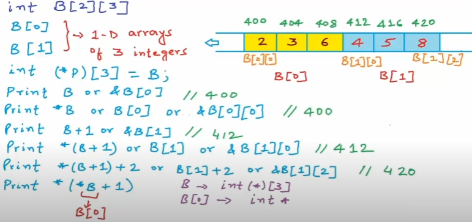

# Pointers

## Memory

When we talk about *memory*, we mostly talk about the RAM. Each segment is 1 byte of memory and each segment have an address.


<!-- | Data Type | Size |
| --- | ----------- |
| `boolean` | 1 byte | 
| `char` | 1 byte |
| `int` | 4 bytes |
| `float` | 4 byte |
| `double` | 8 byte | -->

## Pointers

A *pointer* is a variable whose value is the address of another variable. The data type of the pointer must be the same data type as the variable.

```cpp
  int a = 10; // actual variable declaration
  int *p; // pointer variable declaration 

  p = &a; // store address of var in pointer variable
```

- `&` give me the address of the particular variable. 
- `*p` give me the value at the location that it points to. This is called *dereferencing*

## Pointers Arithmetic

We can perform arithmetic operations on the pointers like addition, subtraction, etc. However, as we know that pointer contains the address, the result of an arithmetic operation performed on the pointer will also be a pointer if the other operand is of type integer.

```cpp
  int a = 10;
  int *p = &a;

  cout << "Pointer points to: " << p << endl; // 0x93f95ff7d4
  cout << "Pointer points to + 1: " << (p + 1) << endl; // 0x93f95ff7d8 (4 bytes more)
``` 

## Pointer to pointer

Pointer to a pointer is a form of multiple indirection or a chain of pointers.
Normally, a pointer contains the address of a variable. When we define a
pointer to a pointer, the first pointer contains the address of the second
pointer, which points to the location that contains the actual value as shown
below.

A variable that is a pointer to a pointer must be declared as such `int **pointerToPointer`.

## Pointer as function arguments

When we declare a variable inside a function, we call it a local variable. We can access this variable only within the function in which we have declared the variable.

- **Call by value**
  
  The call by value method of passing arguments to a function copies the actual value of an argument into the formal parameter of the function. In this case, changes made to the parameter inside the function have no effect on the argument.

  ```cpp
  void increment(int a)
  {
    // The address of this variable is different from the one passed by argument
    a = a + 1; 
  }
  ```

- **Call by reference**
  
  The call by reference method of passing arguments to a function copies the reference of an argument into the formal parameter. Inside the function, the reference is used to access the actual argument used in the call. This means that changes made to the parameter affect the passed argument.

  ```cpp
    void increment(int *p)
  {
    *p = (*p) + 1;
  }
  ```

## Pointers and Arrays

An array is a consecutive group of memory locations that all have the same name and the same type. 


An array is considered to be the same thing as a pointer to the first item in the array. So to see the values of the array, we can do `A[i]` or `*(A + i)`

## Arrays as function arguments

When we pass an array as function arguments, it creates a pointer variable and copy the address of the first element of the array. So the compiler converts the `int A[]` to `int *A`.

Arrays always are  passed as reference parameters. 

## Character arrays and pointers

Strings are groups of characters. The collection of characters is stored in the form of arrays. So strings are arrays of type char terminated with null character, that is, `\0`. Size of array must to be greater than or equal to the number of characters in string + 1.

Arrays and pointers are different types that are used in similar manner. We can use both types to read and write.

If we declare an array of character as `char C[20]`, it will go on the stack. But if we declare as `char *C`, a string literal, it is stored as a compile-time constant, so we cannot modify it.

We can add `const` to the argument of a function. The function can only read and not modify.

## Pointers and multi-dimensional arrays

To declare a 2-dimensional array `int a[row][col]`. So you have `row` 1-d arrays of `col` integers. In memory, each row of the array will occupy `col * sizeof(int)`. 

`b[i][j] = *(b[i] + j) = *(*(b + 1) + j)`

If we want a pointer to point to the array, we must create an array of pointers `int (*p)[col] = a`.



## Dynamic memory

The memory can be divided into 4 segments:

1. Code (text) -> Instruction
2. Static/Global -> Global variables
3. Stack -> Functions and local variables
4. Heap -> Dynamic variables - free pool of memory - `new (malloc)` and `delete (free)`